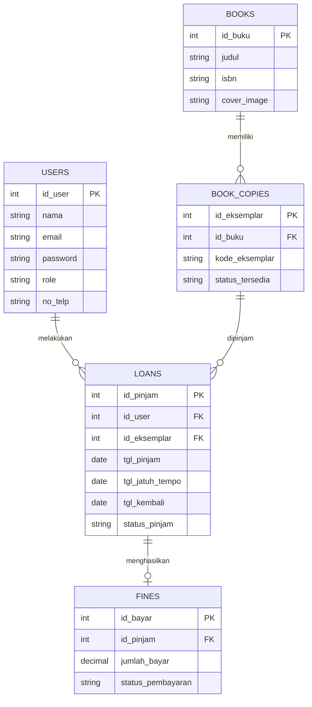

# PustakaHub - Sistem Manajemen Perpustakaan Digital

PustakaHub adalah aplikasi web untuk manajemen perpustakaan yang dibangun menggunakan **CodeIgniter 4**. Aplikasi ini dibuat untuk memenuhi tugas akhir (UAS) mata kuliah Pemrograman Web Lanjut.

## Fitur Utama
- **Manajemen Akun**: Multi-role untuk Admin, Pustakawan, dan Member.
- **Katalog Buku & Eksemplar**: Terintegrasi dengan Open Library API untuk auto-fill data buku menggunakan ISBN.
- **Peminjaman & Denda**: Perhitungan denda otomatis (Rp 2.000/hari) untuk pengembalian yang terlambat.
- **Pembayaran Denda**: Terintegrasi dengan Midtrans Sandbox untuk pembayaran denda online.
- **Notifikasi**: Pengiriman notifikasi otomatis via WhatsApp (WAHA) saat peminjaman disetujui dan pengingat jatuh tempo.
- **Laporan & Dokumen**: Cetak struk peminjaman, kartu anggota, dan laporan bulanan dalam format PDF (menggunakan Dompdf).
- **RESTful API**: Tersedia endpoint API publik di `/api/books` dan `/api/availability`.

## Instalasi

1. Clone repository ini ke komputer Anda.
2. Buka terminal di dalam folder project dan jalankan perintah:
   ```bash
   composer install
   ```
3. Copy file `.env.example` dan ubah namanya menjadi `.env`. Sesuaikan konfigurasi database dan API Key Midtrans Anda di dalam file tersebut.
4. Setup database dapat dilakukan dengan 2 cara:
   - **Cara A (Manual)**: Buat database kosong bernama `db_perpustakaan`, lalu import file `db_perpustakaan.sql` yang sudah disediakan ke dalam phpMyAdmin.
   - **Cara B (Migrate)**: Jalankan migrasi dan seeder untuk membuat tabel serta mengisi data awal:
     ```bash
     php spark migrate --seed
     ```
5. Jalankan server lokal CodeIgniter:
   ```bash
   php spark serve
   ```
   Aplikasi dapat diakses melalui browser pada `http://localhost:8080`.

## Akun Demo
Gunakan akun berikut untuk menguji aplikasi:
- **Admin**: `destian@gmail.com` | Password: `admin123`
- **Member**: `jevon@gmail.com` | Password: `member123`

## Menjalankan Cron Job (Reminder Otomatis)
Untuk menjalankan pengingat jatuh tempo H-1 via WhatsApp secara manual untuk keperluan demo, ketik perintah berikut di terminal:
```bash
php spark app:send_reminder
```

## Entity Relationship Diagram (ERD)
Struktur database telah melalui proses normalisasi hingga bentuk 3NF.



## Screenshot Fitur
  
  

