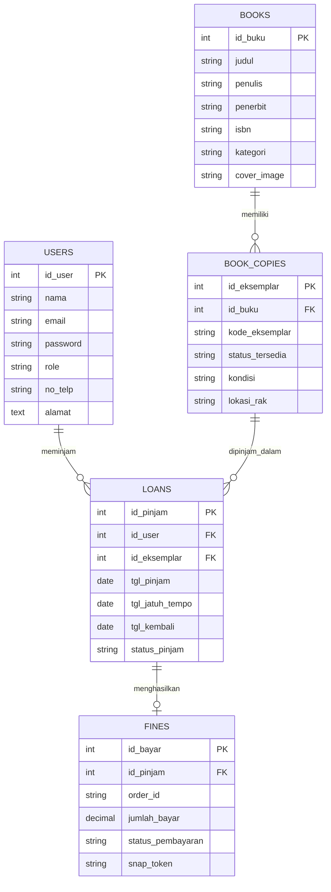

# 📚 PustakaHub - Sistem Manajemen Perpustakaan Digital

PustakaHub adalah Sistem Informasi Manajemen Perpustakaan Digital modern yang dibangun menggunakan **CodeIgniter 4**. Sistem ini dirancang untuk memenuhi spesifikasi Project Pemrograman Web Lanjut (UAS). 

Sistem ini mendukung pengelolaan katalog buku, manajemen eksemplar, peminjaman, pengembalian, dan sistem denda otomatis yang terintegrasi penuh dengan **Midtrans Payment Gateway** dan **WhatsApp Notifications (WAHA)**.

---

## ✨ Fitur Utama

- **Multi-Role Authentication**: Akses berbeda untuk `Admin`, `Pustakawan`, dan `Member`.
- **Open Library API Integration**: Auto-fill detail buku (Judul, Penulis, Penerbit, Cover) hanya dengan memasukkan ISBN.
- **Sistem Denda & Payment Gateway**: Kalkulasi denda otomatis (Rp 2.000/hari) dan integrasi pembayaran online menggunakan **Midtrans Sandbox**.
- **WhatsApp & Email Notifications**: Notifikasi otomatis saat peminjaman disetujui, reminder H-1 jatuh tempo, dan tagihan denda.
- **Laporan & PDF Generation**: Ekspor laporan peminjaman bulanan, tanda terima peminjaman, dan kartu anggota dalam format PDF menggunakan **Dompdf**.
- **RESTful API**: Endpoint publik (`/api/books`, `/api/availability`) untuk konsumsi mobile apps/layanan eksternal.
- **Beautiful UI/UX**: Antarmuka modern, responsif, dan konsisten.

---

## 🛠️ Persyaratan Sistem

- PHP >= 8.2
- MySQL / MariaDB
- Composer
- Extension PHP: `intl`, `mbstring`, `curl`, `json`

---

## 🚀 Cara Instalasi

1. **Clone Repository**
   ```bash
   git clone https://github.com/username/PWL_UAS.git
   cd PWL_UAS
   ```

2. **Install Dependencies**
   ```bash
   composer install
   ```

3. **Konfigurasi Environment**
   Ubah file `.env.example` menjadi `.env` dan atur konfigurasi database serta API Key:
   ```env
   # Database Configuration
   database.default.hostname = localhost
   database.default.database = db_perpustakaan
   database.default.username = root
   database.default.password = 

   # Midtrans Keys (Ganti dengan key sandbox Anda)
   midtrans.serverKey = SB-Mid-server-xxxx
   midtrans.clientKey = SB-Mid-client-xxxx
   
   # WAHA / Email Configs
   waha.endpoint = http://localhost:3000/api/sendText
   ```

4. **Jalankan Migrasi & Seeder**
   Sistem dilengkapi dengan `DummyDataSeeder` yang akan otomatis meng-generate 50 buku, 20 anggota, dan riwayat peminjaman.
   ```bash
   php spark migrate
   php spark db:seed DummyDataSeeder
   ```

5. **Jalankan Server Lokal**
   ```bash
   php spark serve
   ```
   Akses aplikasi di `http://localhost:8080`.

---

## 🔑 Akun Demo

Gunakan akun berikut untuk melakukan testing pada sistem:

| Role | Email | Password |
|---|---|---|
| **Admin** | `admin@pustakahub.com` | `password123` |
| **Pustakawan** | `pustakawan@pustakahub.com` | `password123` |
| **Member** | *Gunakan data dari seeder atau daftar baru* | `password123` |

---

## 📅 Cron Job / Reminder Otomatis

Untuk menjalankan reminder H-1 jatuh tempo secara otomatis, jalankan Spark command berikut secara manual atau daftarkan pada Task Scheduler/Crontab:
```bash
php spark app:send_reminder
```

---

## 🗺️ Entity Relationship Diagram (ERD)

Struktur database kami telah dinormalisasi hingga bentuk 3NF untuk menghindari redudansi data antara Buku dan Eksemplar.



---

## 📸 Screenshot Fitur Utama

*(Harap tambahkan screenshot dari aplikasi Anda di bawah ini sebelum pengumpulan!)*

- **Dashboard Admin:** ``
- **Peminjaman Buku:** ``
- **Katalog Buku Member:** ``
- **Payment Gateway Midtrans:** ``
